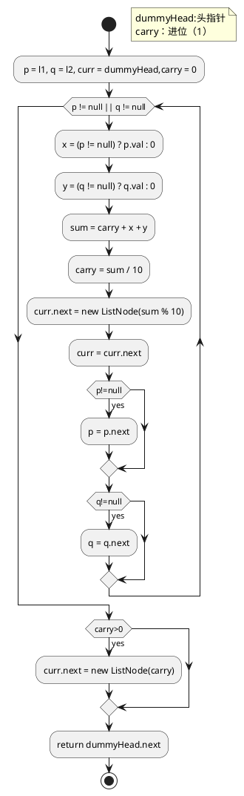

# 1. AddTwoNumber

You are given two non-empty linked lists representing two non-negative integers. The digits are stored in reverse order and each of their nodes contain a single digit. Add the two numbers and return it as a linked list.

You may assume the two numbers do not contain any leading zero, except the number 0 itself.

Example:

```
Input: (2 -> 4 -> 3) + (5 -> 6 -> 4)
Output: 7 -> 0 -> 8
Explanation: 342 + 465 = 807.
```
* 官方解决：
```java
/**
 * Definition for singly-linked list.
 * public class ListNode {
 *     int val;
 *     ListNode next;
 *     ListNode(int x) { val = x; }
 * }
 */
public ListNode addTwoNumbers(ListNode l1, ListNode l2) {
    ListNode dummyHead = new ListNode(0);
    ListNode p = l1, q = l2, curr = dummyHead;
    int carry = 0;
    while (p != null || q != null) {
        int x = (p != null) ? p.val : 0;
        int y = (q != null) ? q.val : 0;
        int sum = carry + x + y;
        carry = sum / 10;
        curr.next = new ListNode(sum % 10);
        curr = curr.next;
        if (p != null) p = p.next;
        if (q != null) q = q.next;
    }
    if (carry > 0) {
        curr.next = new ListNode(carry);
    }
    return c
}
```



* 我的
```java
/**
 * Definition for singly-linked list.
 * public class ListNode {
 *     int val;
 *     ListNode next;
 *     ListNode(int x) { val = x; }
 * }
 */
class Solution {
    public ListNode addTwoNumbers(ListNode l1, ListNode l2) {
               ListNode l3 = new ListNode(0);
               l3.next = l1;
            while (l1!=null || l2!=null){
                l1.val +=l2.val;
                if (l1.val >=10){
                    l1.val -= 10;
                    if(l1.next!=null)
                    l1.next.val+=1;
                    else{
                        l1.next = new ListNode(1);
                    }
                }
                if(l1.next==null&&l2.next==null)
                    break;
                
                if(l1.next == null){
                          l1.next=new ListNode(0);
                         l1= l1.next;
                }
                else
                    l1=l1.next;
               if(l2.next == null){
                    l2.next= new ListNode(0);
                    l2 = l2.next;
               }
                else
                    l2=l2.next;
           
            }
        return l3.next;
    }
}
```