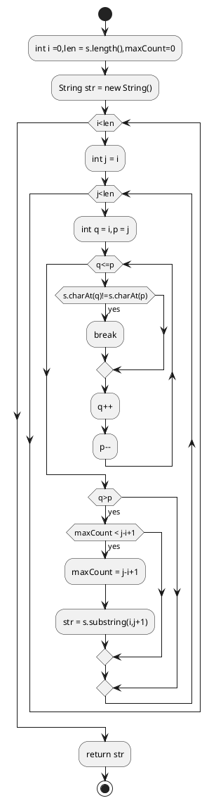

# 1. Longest Palindromic Substring

Given a string s, find the longest palindromic substring in s. You may assume that the maximum length of s is 1000.

Example1:

```
Input: "babad"
Output: "bab"
Note: "aba" is also a valid answer.
```
Example2:
```
Input: "cbbd"
Output: "bb"
```

## 1.1. Brute Force

```java
class Solution {
    public String longestPalindrome(String s) {
        int i =0; int len =s.length();
        int maxCount = 0;
        String str = new String();
        for(;i<len;i++){
            for(int j =i;j<len;j++){
                int q = i;
                int p = j;
                while(q<=p){
                    if(s.charAt(q)!=s.charAt(p)){
                      break;
                    }
                    q++;
                    p--;
                }
                if(q>p){
                  if(maxCount < j-i+1){
                            maxCount = j-i+1;
                            str = s.substring(i,j+1);
                     }
                }
            }
        }
        return str; 
    }
}
```



## 1.2. Recursion

```java

class Solution {
class Solution {
    private String  rebot(String s,int start,int end){
        if(start == end){
            return s.substring(start,end+1);
        }
        if(isPalindrome(s,start,end)){
            return s.substring(start,end+1);
        }
        String left = rebot(s,start+1,end);
        String right = rebot(s,start,end-1);
        return left.length()>right.length()?left:right;

    }
    private boolean isPalindrome(String s,int i,int j){
        while(i<j){
            if(s.charAt(i)!=s.charAt(j)){
                  return false;
            }
            i++;
            j--;
        }
            return true;
    }

    public String longestPalindrome(String s) {
 return s.length()>0?rebot(s,0,s.length()-1):"";
    }
}
}
```

## 1.3. Memoized Solution

```java
class Solution {
    private String  rebot(String s,int start,int end,Set set){
        System.out.println(set);
        if(set.contains(s.substring(start,end+1)))
            return s.substring(start,end+1);
        if(start == end){
            set.add(s.substring(start,end+1));
            return s.substring(start,end+1);
        }
        if(isPalindrome(s,start,end)){
            set.add(s.substring(start,end+1));
            return s.substring(start,end+1);
        }
        String left = rebot(s,start+1,end,set);
        String right = rebot(s,start,end-1,set); 
        return left.length()>right.length()?left:right;
    }
    private boolean isPalindrome(String s,int i,int j){
        while(i<j){
            if(s.charAt(i)!=s.charAt(j)){
                  return false;
            }
            i++;
            j--;
        }
            return true;
    }
    
    public String longestPalindrome(String s) {
        Set set = new HashSet<String>();
 return s.length()>0?rebot(s,0,s.length()-1,set):"";
    }    
}
```

## 1.4. Dynamic programming

```java
    public String longestPalindrome(String s) {
        int n = s.length();
         if (n == 0)
            return "";
        boolean table[][] = new boolean[n][n];
        int start =0;
        int MaxLength =1;
        for (int i=0;i<n;i++){
            table[i][i] = true;
        }
        for (int i = 0;i<n-1;i++){
            int j = i+1;
            if(s.charAt(i) == s.charAt(j)){
                table[i][j] = true;
                start = i;
              MaxLength = 2;  
            }
        }
        for (int k = 3;k<=n;k++){
            for(int i=0;i<n-k+1;i++){
                int j = i+k-1;
                if(s.charAt(i)==s.charAt(j)&&table[i+1][j-1]){
                    table[i][j] = true;
                if(MaxLength<k){
                    MaxLength = k;
                    start = i;
                  }
                }
            }
        }
        return s.substring(start,start+MaxLength);
     }
```

```puml
start
:int n = s.length();
if(n == 0) then (yes)
:return "";
stop
endif
:boolean table[][] = new boolean[n][n];   int start = 0, MaxLength = 1;
while( i<n )
:table[i][i] = true;
:i++;
endwhile
while(i<n-1)
:int j = i+1;
if(s.charAt(i) == s.charAt(j)) then (yes)
:table[i][j] = true;
:start = i;
:MaxLength = 2;
endif
:i++;
endwhile

while (k<=n)
while (i<n-k+1)
:int j = i+k-1;
if (s.charAt(i) == s.charAt(j) && table[i+1][j-1]) then (yes)
:table[i][j] = true;
if (MaxLength < k) then (yes)
:MaxLength = k;
:start = i;
endif
endif
:i++;
endwhile
:k++;
endwhile
:return s.substring(start,start+MaxLength);
stop


```

## 1.5. Expand Around Center

```java
public String longestPalindrome(String s) {
    if (s == null || s.length() < 1) return "";
    int start = 0, end = 0;
    for (int i = 0; i < s.length(); i++) {
        int len1 = expandAroundCenter(s, i, i);
        int len2 = expandAroundCenter(s, i, i + 1);
        int len = Math.max(len1, len2);
        if (len > end - start) {
            start = i - (len - 1) / 2;
            end = i + len / 2;
        }
    }
    return s.substring(start, end + 1);
}

private int expandAroundCenter(String s, int left, int right) {
    int L = left, R = right;
    while (L >= 0 && R < s.length() && s.charAt(L) == s.charAt(R)) {
        L--;
        R++;
    }
    return R - L - 1;
}
```