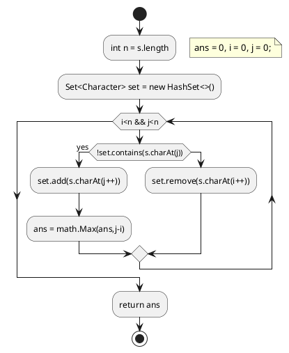

# 1. Longest Substring Without Repeating Characters (最长的无重复子串)


Given a string, find the length of the longest substring without repeating characters.

example1
```
Input: "abcabcbb"
Output: 3 
Explanation: The answer is "abc", with the length of 3. 
```
example2
```
Input: "bbbbb"
Output: 1
Explanation: The answer is "b", with the length of 1.
```
example3
```
Input: "pwwkew"
Output: 3
Explanation: The answer is "wke", with the length of 3. 
             Note that the answer must be a substring, "pwke" is a subsequence and not a substring.
```
## 1.1. Brute Fore(暴力解发)
我的：
```java
class Solution {
    public int lengthOfLongestSubstring(String s) {
        int flag=0;
        int maxCount=1;
         java.util.HashSet<Character> set = new  java.util.HashSet<Character>();
        for (int i=0;i<s.length();i++){
        set.add(s.charAt(i)); 
        for(int j =i+1;j<s.length();j++){
        if( !set.add(s.charAt(j)) ){
            maxCount=maxCount>set.size()?maxCount:set.size();
            set.clear();
            flag=1;
            break;
         }   
      }                  
    }
        maxCount = maxCount>set.size()?maxCount:set.size();
        return flag==1?maxCount:set.size();
       
    }
```
官方：
```java
public class Solution {
    public int lengthOfLongestSubstring(String s) {
        int n = s.length();
        int ans = 0;
        for (int i = 0; i < n; i++)
            for (int j = i + 1; j <= n; j++)
                if (allUnique(s, i, j)) ans = Math.max(ans, j - i);
        return ans;
    }

    public boolean allUnique(String s, int start, int end) {
        Set<Character> set = new HashSet<>();
        for (int i = start; i < end; i++) {
            Character ch = s.charAt(i);
            if (set.contains(ch)) return false;
            set.add(ch);
        }
        return true;
    }
}
```

## 1.2. Sliding Window(滑动窗口)
暴力方法一旦发现下一个元素，在前面的子串中便要抛弃已计算的子串，所以会重复计算子串。
滑动窗口方法则不会重复计算，[i,j)的窗口，通过i+1移动且缩小窗口，j+1扩展窗口。

```java
public class Solution {
    public int lengthOfLongestSubstring(String s) {
        int n = s.length();
        Set<Character> set = new HashSet<>();
        int ans = 0, i = 0, j = 0;
        while (i < n && j < n) {
            // try to extend the range [i, j]
            if (!set.contains(s.charAt(j))){
                set.add(s.charAt(j++));
                ans = Math.max(ans, j - i); 
            }
            else {
                set.remove(s.charAt(i++));
            }
        }
        return ans;
    }
}
```



## 1.3. Sliding Window Optimized(滑动窗口优化)

正常的滑动窗口，遇到重复的字符时，无法快速定位在子串中位置。
使用HashMap记录位置，可免去定位的计算。

```java
public class Solution {
    public int lengthOfLongestSubstring(String s) {
        int n = s.length(), ans = 0;
        Map<Character, Integer> map = new HashMap<>(); // current index of character
        // try to extend the range [i, j]
        for (int j = 0, i = 0; j < n; j++) {
            if (map.containsKey(s.charAt(j))) {
                i = Math.max(map.get(s.charAt(j)), i);//假如新进入的字符在前面出现过，但又未在现在的窗口内，是应当加入当前窗口的，i（可以比作右指针）不需要改变，所以要比较大小。
            }
            ans = Math.max(ans, j - i + 1);
            map.put(s.charAt(j), j + 1);
        }
        return ans;
    }
}
```

```puml
start
floating note right
   ans = 0, i = 0, j = 0;
end note
:int n = s.length();
:Map<Character, Integer> map = new HashMap<>();
while (j<n)
if (map.containsKey(s.charAt(j))) then (yes)
: i = Math.max(map.get(s.charAt(j)),i);
endif
:ans = Math.max(ans,j-i+1);
:map.put(s.charAt(j),j+1);
:j++;
endwhile
:return ans;
stop
```

更多优化用整型数组代替HashMap，数组大小根据字符串内容而定
* int[26] ：纯英文字母但是只能纯大写或纯小写
* int[128]：ASCII
* int[256]：扩展形ASCII

```java
public class Solution {
    public int lengthOfLongestSubstring(String s) {
        int n = s.length(), ans = 0;
        int[] index = new int[128]; // current index of character
        // try to extend the range [i, j]
        for (int j = 0, i = 0; j < n; j++) {
            i = Math.max(index[s.charAt(j)], i);
            ans = Math.max(ans, j - i + 1);
            index[s.charAt(j)] = j + 1;
        }
        return ans;
    }
}
```