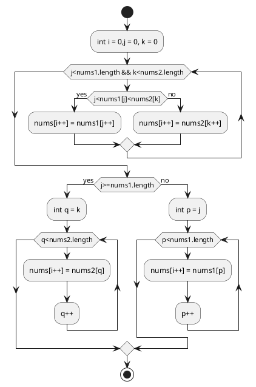

# 1. Median of Two Sorted Arrays

There are two sorted arrays nums1 and nums2 of size m and n respectively.

Find the median of the two sorted arrays. The overall run time complexity should be O(log (m+n)).

You may assume nums1 and nums2 cannot be both empty.

Example 1:

```
nums1 = [1, 3]
nums2 = [2]

The median is 2.0
```

Example 2:

```
nums1 = [1, 2]
nums2 = [3, 4]

The median is (2 + 3)/2 = 2.5
```
## 1.1. my solution
```java
class Solution {
 public double findMedianSortedArrays(int[] nums1, int[] nums2) {
        int length = nums1.length + nums2.length;
        int[] nums = new int[length];
        Merge(nums,nums1,nums2);
        if(nums.length%2!=0)
            return nums[nums.length/2]+0.0;
     else
            return (nums[nums.length/2]+ nums[nums.length/2-1])/2.0 ;
    }
    public void Merge(int[] nums,int[] nums1,int[] nums2){
         int i=0;int j =0; int k =0;
        while(j<nums1.length&&k<nums2.length){
            if(nums1[j]<nums2[k]){
                nums[i++] = nums1[j++];
            } else {
                nums[i++] = nums2[k++];
            }
        }
        if(j>=nums1.length){
          for(int q =k;q<nums2.length;q++){
                nums[i++]=nums2[q];
            }
         }
        else {
             for(int p = j ;p<nums1.length;p++){
                nums[i++]=nums1[p];
            }
         }
    }
}
```

