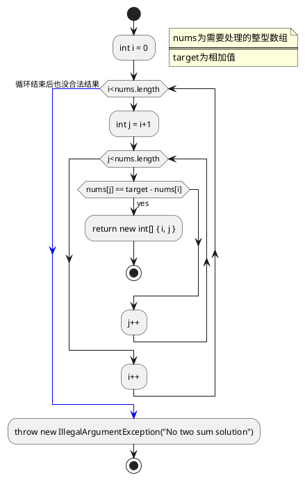
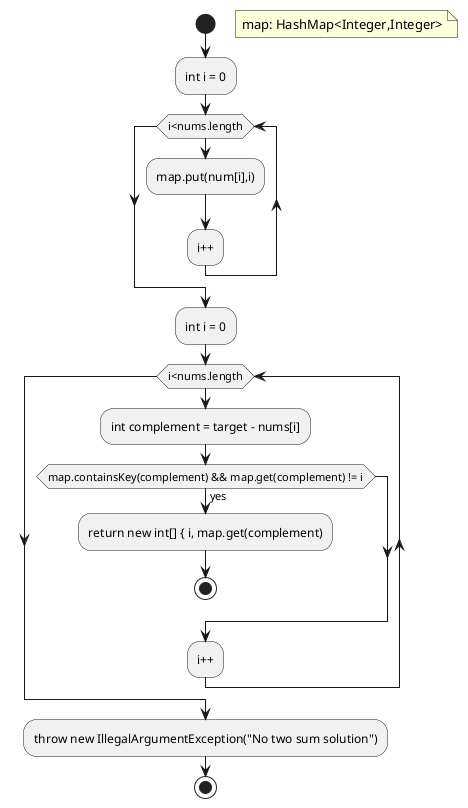
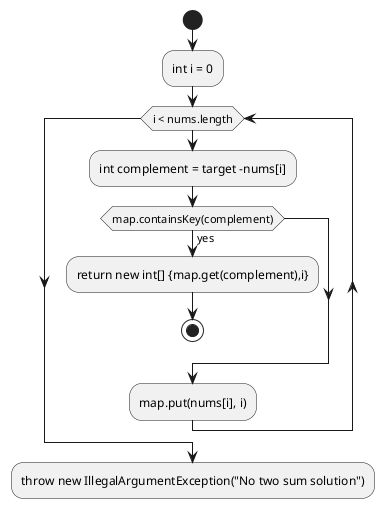

# 1. twoSum

Given an array of integers, return indices of the two numbers such that they add up to a specific target.

You may assume that each input would have exactly one solution, and you may not use the same element twice.

```
Given nums = [2, 7, 11, 15], target = 9,

Because nums[0] + nums[1] = 2 + 7 = 9,
return [0, 1].
```

## 1.1. Brute Force（暴力解法）

```java
public int[] twoSum(int[] nums, int target) {
    for (int i = 0; i < nums.length; i++) {
        for (int j = i + 1; j < nums.length; j++) {
            if (nums[j] == target - nums[i]) {
                return new int[] { i, j };
            }
        }
    }
    throw new IllegalArgumentException("No two sum solution");
}
```

* 因为有两层嵌套循环时间复杂度为：O(n^2)
* 空间复杂度为：O(1)

## 1.2. Two-pass Hash Table（双哈希）

```java
public int[] twoSum(int[] nums, int target) {
    Map<Integer, Integer> map = new HashMap<>();
    for (int i = 0; i < nums.length; i++) {
        map.put(nums[i], i);
    }
    for (int i = 0; i < nums.length; i++) {
        int complement = target - nums[i];
        if (map.containsKey(complement) && map.get(complement) != i) {//避免有target为某个数两倍的情况，返回两个同样的索引，eg target=10 ，{5,5,1，...},应该返回{0,1}而不是{0,0}
            return new int[] { i, map.get(complement) };
        }
    }
    throw new IllegalArgumentException("No two sum solution");
}
```

* 时间复杂度为：O(n)
* 因每个值都存入hashmao中，所以空间复杂度为：O(n)

## 1.3. One-pass Hash Table （单哈希）

```java
public int[] twoSum(int[] nums, int target) {
    Map<Integer, Integer> map = new HashMap<>();
    for (int i = 0; i < nums.length; i++) {
        int complement = target - nums[i];
        if (map.containsKey(complement)) {
            return new int[] { map.get(complement), i };
        }
        map.put(nums[i], i);
    }
    throw new IllegalArgumentException("No two sum solution");
}
```

* 时间复杂度为：O(n)
* 因每个值都存入hashmao中，所以空间复杂度为：O(n)