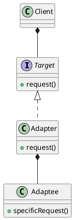

# 1. Adapter(适配器)

**适配器模式**：将一个类的接口，转换成客户期望的另一个接口。适配器让原本接口不兼容的类可合作无间

* 对象适配器：

```puml
@startuml
interface Target{
 +request()
}
class Adapter{
+request()
}
class Adaptee{
+specificRequest()
}

Client *-- Target
Target <|..Adapter
Adapter *-- Adaptee
@enduml
```