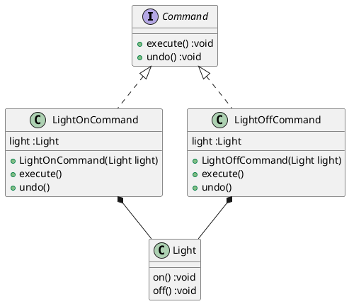

# 1. Command

**命令模式**将“请求”封装成对象，以便使用不同的请求、队列、或者日志来参数化其他对象。命令模式也支持可撤销的操作

```puml
@startuml
interface Command {
  +execute() :void
  +undo() :void
}
class Light {
  on() :void
  off() :void
}

class LightOnCommand {
   light :Light
   +LightOnCommand(Light light)
   +execute()
   +undo()
}

class LightOffCommand {
   light :Light
   +LightOffCommand(Light light)
   +execute()
   +undo()
}
Command <|.. LightOnCommand
Command <|.. LightOffCommand
LightOnCommand *-- Light
LightOffCommand *-- Light

@enduml
```