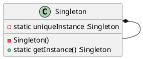

# 1. Singleton

**单件模式** 确保一个类只有一个实例，并提供一个全局访问点。
类图：


* 性能对程序不是很关键
```java
public class Singleton {
      private static Singleton uniqueInstance;

      private Singleton() {}

      public static synchronized Singleton getInstance() {
              if (uniqueInstance == nul) {
                 uniqueInstance = new Singleton();
              }
              return uniqueInstance;
      }
}
```

* 急切创建实例
```java
public class Singleton {
      private static Singleton uniqueInstance = new Singleton();

      private Singleton() {}

      public static d Singleton getInstance() {
          
              return uniqueInstance;
      }
}
```

* 双重检查加锁

```java
public class Singleton {
      private volatile static Singleton uniqueInstance;

      private Singleton() {}

      public static Singleton getInstance() {
              if (uniqueInstance == nul) {
              synchronized（Singleton.class）{
              if (uniqueInstance == nul)
                 uniqueInstance = new Singleton();
                 }
              }
              return uniqueInstance;
      }
}
```


