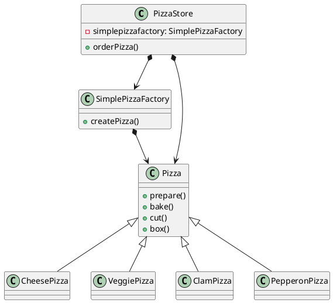
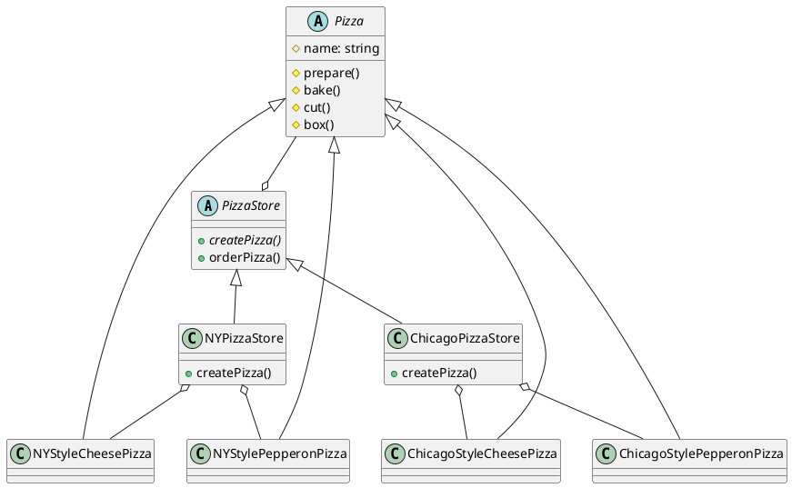

# 1. factory(工厂模式）

工厂（factory）处理创建对象的细节

## 1.1. 简单工厂模式

简单工厂其实不是一种设计模式。



## 1.2. 工厂方法模式

工厂方法模式定义了一个创建对象的**接口** ，由子类决定要实例化的类是哪一个。工厂方法让类把实例化推迟到子类。创建对象的方法为工厂方法。



## 1.3. 抽象工厂模式

抽象工厂模式提供一个接口，用于创建相关或依赖对象的家族，而不需要明确指定具体类

```puml
interface ConfigurableWebServerFactory{
+setPort(int): void
+setAddress(InetAddress): void
+setErrorPages(Set<? extends ErrorPage>): void
+setSsl(Ssl): void
+setSslStoreProvider(SslStoreProvider): void
+setHttp2(Http2): void
+setCompression(Compression): void
+setServerHeader(String): void
}
abstract class AbstractConfigurableWebServerFactory {
  -port： int 
  -address: inetAddress
  -errorPages: Set<ErrorPage> 
  -ssl: Ssl
  -sslStoreProvider: SslStoreProvider
  -http2: Http2
  -compression: Compression
  -ServerHeader: String
  +getPort()
  +setPort()
  +getAddress()
  +setAddress()
  +getErrorPages()
  +setErrorPages()
  +addErrorPages()
  +getSsl()
  +setSsl()
  +getSslStoreProvider()
  +setSslStoreProvider()
  +getHttp2()
  +setHttp2()
  +getCompression()
  +setCompression()
  +getServerHeader()
  +setServerHeader()
  +createTempDir()
}
ConfigurableWebServerFactory <|.. AbstractConfigurableWebServerFactory

```